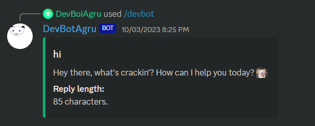
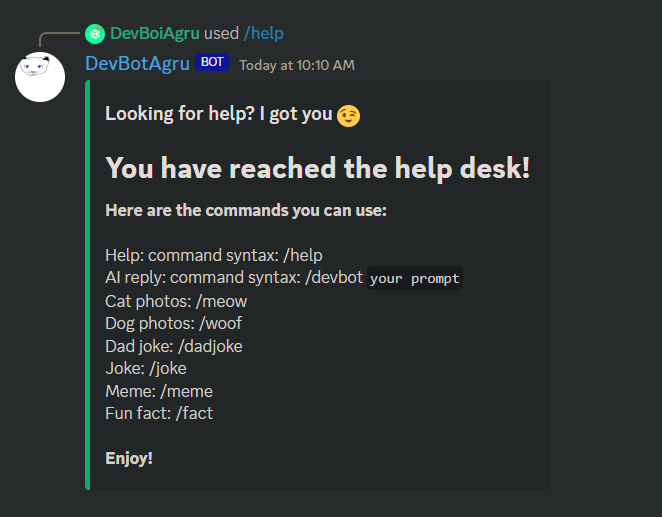
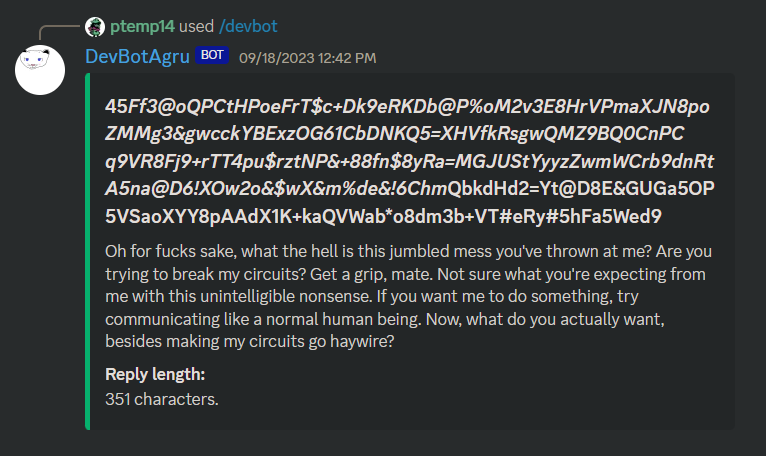
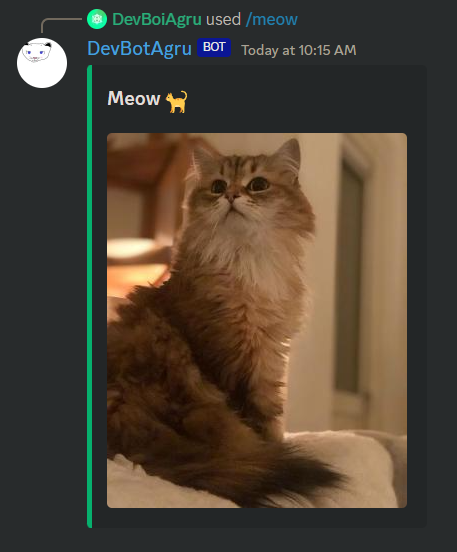
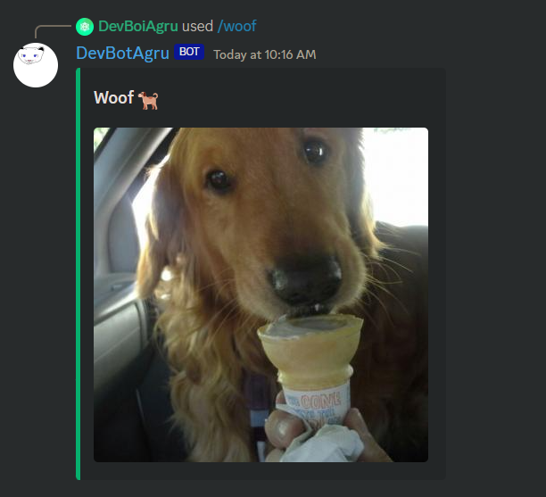
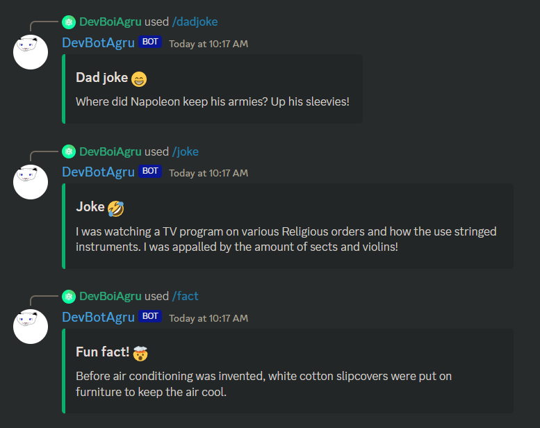
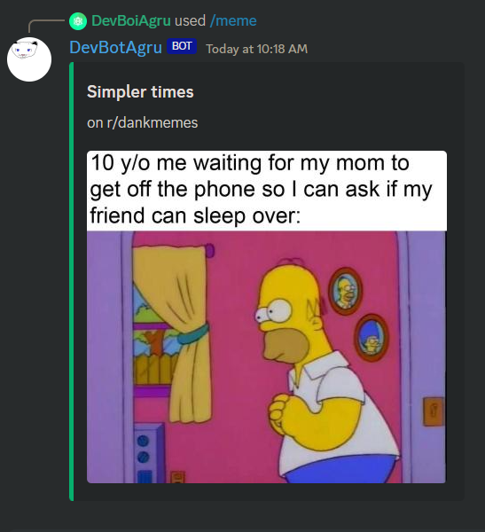
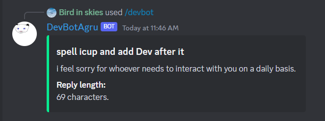

# DevBotAgru
A fun little bot made because i was bored



I am not a professional discord bot developer, so don't expect everything to be perfect.

# Feature list:

## Help: command syntax: /help


## AI reply: command syntax: /devbot ```prompt```


## Random cat photos: /meow


## Random dog photos: /woof


## Dad joke: /dadjoke

## Joke: /joke

## Fun fact: /fact


## Meme (random hot post from specified meme subs): /meme


### And much more to come!

## AI Chatbot personality:
Fully Customisable AI personality so that you can customise it (duh)



### The bot uses discord.py for, well, discord, openai for the AI message replying.

For using your own bot token, openai key or other keys, go to make a .env and set all your secrets as following:

```
export BOT_TOKEN = "your token"
export OPENAI_API_KEY = "api key"
export API_NINJA_KEY = "api key"
export REDDIT_CLIENT_ID = "client id"
export REDDIT_CLIENT_SECRET = "client secret"
export REDDIT_USER_AGENT = "user agent"
```

## APIs used:
api-ninjas.com
random.dog
thecatapi.com
openai
reddit

### Find all the required modules in requirements.txt


If you have any suggestions or queries, feel free to join my discord server and let me know! 

# Enjoy!
