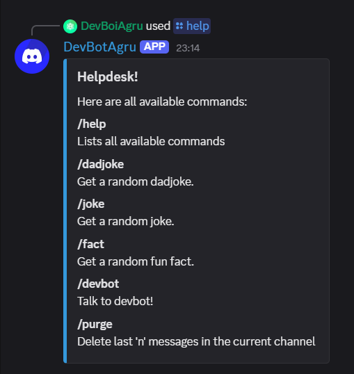
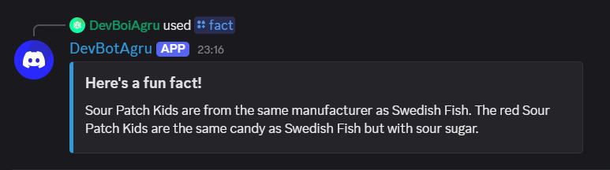
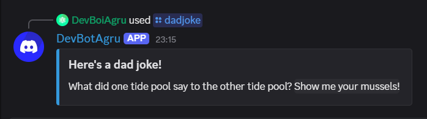
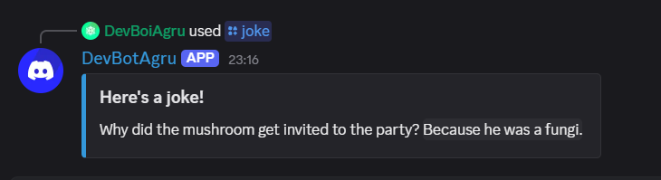

# DevBotAgru

> Go rewrite. Old python code is available on the python-legacy branch

A fun little bot made because i was bored

## Features:

**AI Chatbot:** Remembers messages for each server and replies accordingly. Fully customisable personality.

**Entertainment:** Easily customisable offline jokes and facts database.

**Moderation:** /purge `number` remove last few messages in the current channel

## Commands:

-   **/help**
    

-   **/fact**
    

-   **/dadjoke**
    

-   **/joke**
    

### A Gemini API key is required to use the chatbot. Get it from https://ai.google.dev/gemini-api/ for free.

## Build instructions:

**Prerequisites**: Go needs to be installed.

Clone the repo, cd into it, and run `go build main.go`

# Enjoy!
