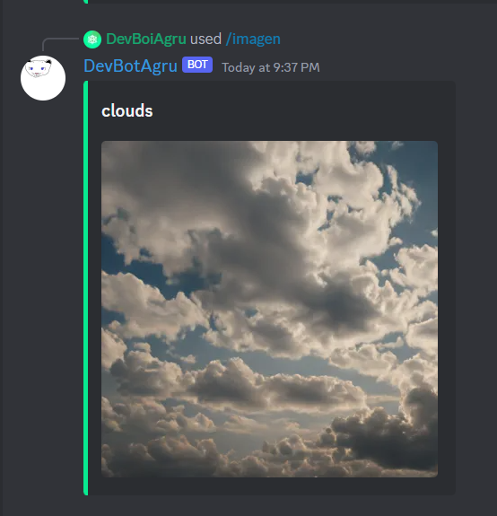

# DevBotAgru
A fun little bot made because i was bored


I am not a professional discord bot developer, so don't expect everything to be perfect.

# Feature list:

## Help: /help


## AI reply: /devbot ```prompt```


## AI text to image generation: /imagen ```prompt```


## Random cat photos: /meow


## Random dog photos: /woof


## Dad joke: /dadjoke

## Joke: /joke

## Fun fact: /fact


## Meme (random hot post from specified meme subs): /meme


<hr>

**Moderation:**

- /ban `user` `reason`
- /kick `user` `reason`
- /unban `user` `reason`
- /timeout `user` `reason` `duration`
- /untimeout `user`
- /nick `user` `new nick`
- /purge `number`

### And much more to come!

For using your own bot token, and other keys, go to make a .env and set all your secrets as following:

```
export BOT_TOKEN                = bot discord token
export API_NINJA_KEY            = api ninja key
export REDDIT_CLIENT_ID         = reddit client id
export REDDIT_CLIENT_SECRET     = reddit client secret
export REDDIT_USER_AGENT        = reddit username
export DOPPLE_ID                = dopple id
export DOPPLE_CHAT_ID           = dopple chat id
export DOPPLE_USERNAME          = dopple username
export DOPPLE_COOKIE            = dopple cookie
```

## APIs used:
api-ninjas.com
random.dog
thecatapi.com
reddit

### Find all the required modules in requirements.txt

If you have any suggestions or queries, feel free to join my discord server and let me know! 

# Enjoy!
